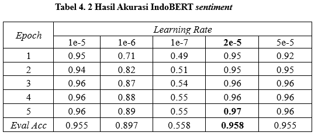
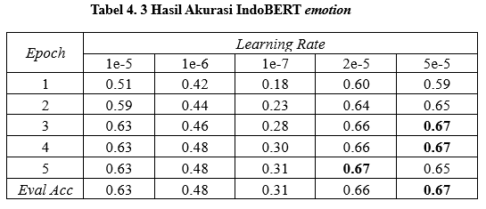
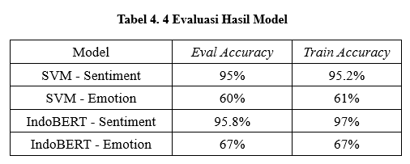

# svm-indobert-analysis
Merupakan projek tugas akhir (skripsi) Aldrian Aliv, projek ini menganalisis penggunaan IndoBERT dan SVM dalam analisis sentimen dan emosi pada teks.

# Dataset
Dataset yang digunakan dalam penelitian ini berasal dari penelitian "PRDECT-ID: Indonesian product reviews dataset for emotions classification tasks" oleh Rhio Sutoyo, Said Achmad, Andry Chowanda, Esther Widhi Andangsari, Sani M. Isac. (https://doi.org/10.1016/j.dib.2022.108554)

# IndoBERT
Model pre-trained IndoBERT digunakan untuk menganalisis sentimen dan emosi yang tergantung dalam teks review dari dataset.

# SVM
Model tradisional SVM digunakan untuk menganalisis sentimen dan emosi yang tergantung dalam teks review dari dataset.

.png)

# Hasil
IndoBERT unggul dalam hal akurasi, tetapi SVM unggul dalam hal efiesiensi.

